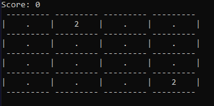

# 2048 Terminal Game (C++)

A simple **terminal-based 2048 game** written in C++ using Visual Studio.

## 📜 How to Play

- Use **Arrow Keys** or **WASD** to slide tiles.
- When **two tiles of the same number collide**, they **merge into one**.
- Your goal is to **reach 2048**!
- The game **ends when no moves are left**.
- Press **'Q' to quit**.

## 🎮 Demo


## 🛠 Installation & Setup

### 📌 Requirements
- **Windows** with **Visual Studio**
- C++ Compiler (MSVC, MinGW, or Clang)

### 📌 Steps to Run
1. **Clone this repository**:
   ```sh
   git clone git@github.com:zjason25/2048_console.git
   cd 2048-cpp
2. **Open `2048.sln` in Visual Studio**.
3. **Set build mode to `Release` or `Debug`**.
4. **Click Start (F5) to compile and run**

## 🎮 Controls

| Key  | Action         |
|------|--------------|
| `W` or `↑`   | Move Up     |
| `A` or `↓`  | Move Left   |
| `S` or  `←` | Move Down   |
| `D` or  `→` | Move Right  |
| `Q`  | Quit Game   |

## 🔮 Future Improvements

- [ ] **Highest Score Tracking**
- [ ] **Save & Load Game State**
- [ ] **Better UI (Colors & Formatting)**
